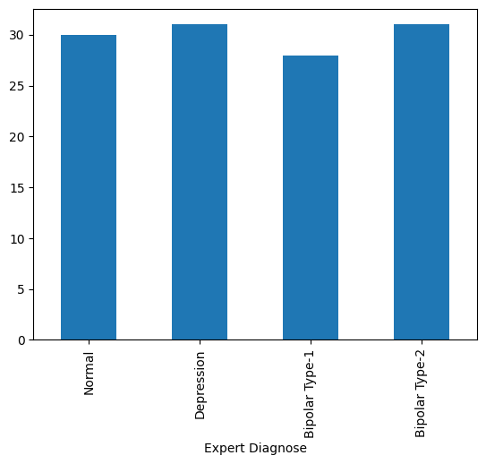

# Mental Disorders Diagnosis

Multiclass classification of a mental disorder, based on the survey-collected symptoms.

Dataset available at [kaggle](https://www.kaggle.com/datasets/mdsultanulislamovi/mental-disorders-dataset).

There are 4 unique classes in the dataset:



## Project setup

```sh
uv sync
```

## Evaluate model using UI + model server

```sh
# Run backend
uv --directory model_server/ run model_server.py
```

(In separate terminal)
```sh
uv run streamlit run model_server/frontend.py
```
